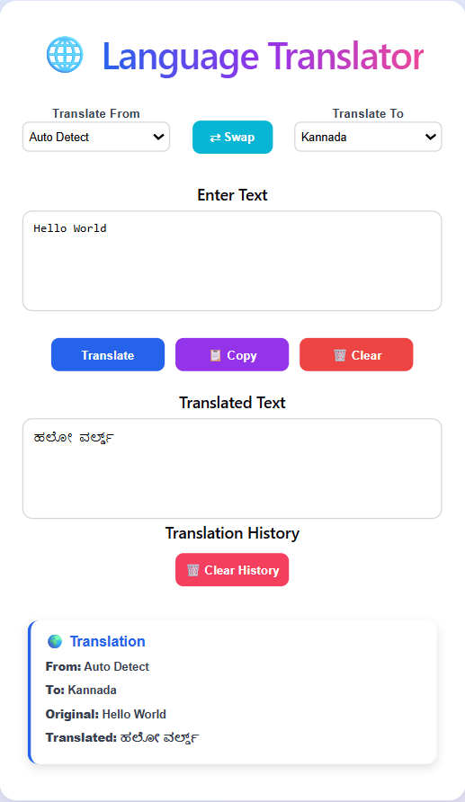

# 🌐 Language Translator

A full-stack Language Translator web application built using **React**, **FastAPI**, and **MongoDB Atlas**. The application translates text into multiple languages and stores translation history in MongoDB.

## 🚀 Features

- 🌍 Translate text into multiple languages
- 🔎 Auto Detect source language
- 🔄 Swap source and target languages
- 📋 Copy translated text
- 🗑️ Clear input text
- 📜 Translation history
- 🗑️ Clear translation history
- ☁️ MongoDB Atlas integration
- 🌐 Fully deployed using Render

## 🛠️ Tech Stack

- React
- JavaScript
- HTML
- CSS
- FastAPI (Python)
- MongoDB Atlas
- Render

## 📸 Screenshot



## 🔗 Live Demo

**Frontend:**  
https://language-translator-client.onrender.com

**Backend API:**  
https://language-translator-server.onrender.com/docs

## 📂 Project Structure

```
LanguageTranslator/
├── client/
├── server/
├── screenshots/
└── README.md
```

## 👩‍💻 Author

**Hrishitha Gowda**

GitHub: https://github.com/hrishithagowda
